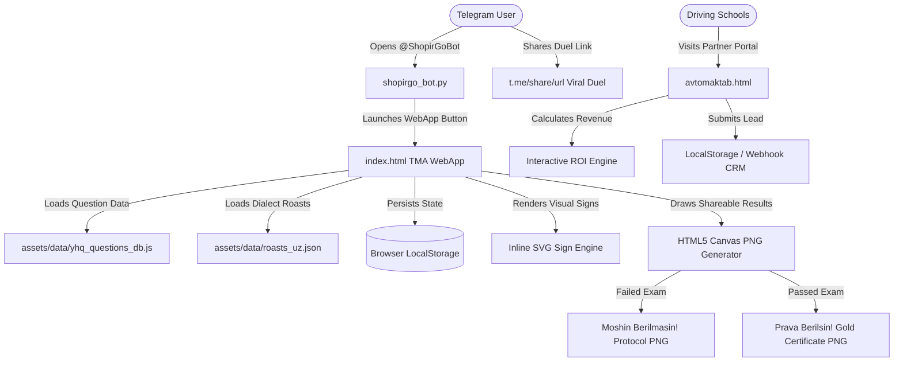

# 🔍 ShopirGo — Agent Code Review & Architectural Audit Guide

This document is prepared specifically for an **autonomous AI agent or software engineer** conducting a comprehensive code review of the **ShopirGo** codebase.

---

## 📋 Executive Summary

| Attribute | Specification |
| :--- | :--- |
| **Product Name** | **ShopirGo** (formerly PravaGo) |
| **Platform** | Telegram Mini App (TMA) + Web App + Telegram Bot |
| **Target Audience** | Drivers & driving license candidates in Uzbekistan (18–50+ years old) |
| **Language & Locale** | Uzbek Latin (`uz`), Russian (`ru` in store listing) |
| **Core Value Prop** | Gamified, sarcastic driving test preparation with 2024–2026 legal traffic rules and folk instructor Shokir aka |
| **Architecture** | Client-side Single Page Application (SPA) + Vanilla JS + HTML5 Canvas + Python Telegram Bot |
| **Build System** | Zero-build (pure ES6, Tailwind CSS CDN, HTML5 primitives, no webpack/vite lock-in) |
| **Live Endpoints** | TMA: `https://gptify.github.io/ShopirGo/` \| Bot: `@ShopirGoBot` |

---

## 🏗️ Architectural Overview & Core Systems



### 1. State Management (`index.html`)
The application uses a centralized reactive state object:
```javascript
const state = {
  userGender: 'male',      // 'male' | 'female'
  userAgeGroup: 'young',   // 'young' (<55) | 'elder' (55+)
  sarcasmLevel: 'medium',  // 'mild' | 'medium' | 'spicy'
  mistakesCount: 0,        // Current quiz/exam mistake counter
  garage: ['matiz'],       // Unlocked collectible cars
  selectedCar: 'cobalt',   // Currently active vehicle
  mistakesBank: [],        // Failed questions queue for spaced repetition
  starsBalance: 450,       // In-game economy currency
  // ...
};
```
State is automatically synchronized with `localStorage` keys (`shopirgo_gender`, `shopirgo_user_name`, `shopirgo_mistakes_bank`, `shopirgo_stars`, etc.).

### 2. Demographic & Honorific Engine
One of the most nuanced aspects of the codebase is the strict grammatical engine (`resolveInstructorSpeech` and `formatInstructorSpeech`):
- **Younger Male (`<55`)**: Uses **"Sen"** / *"Uka"* with informal imperative endings (`-o'tir`, `-bos`, `-san`).
- **Female (all ages)**: Always addressed as **"Siz"** / *"Singlim"* / *"Opa"* with polite respectful verb conjugations (`-bosing`, `-o'tiring`).
- **Elder Male (`55+`)**: Always addressed as **"Siz"** / *"Aka"*.
- **Auto-Detection**: Inspects `window.Telegram.WebApp.initDataUnsafe.user.first_name` using Uzbek feminine suffixes (`-a`, `-o`, `-oy`, `-xon`, `-bonu`, etc.) with fallback to the 1-tap header toggle.

### 3. Exam Simulation Engine
- **20 Questions per Exam**: Pulled either sequentially from official tickets (Tickets 1–5) or randomized.
- **Strict 2-Mistake Rule**: In accordance with Uzbekistan's official state testing centers (DYP / Davlat Test Markazi), a candidate fails immediately upon the 3rd error.
- **20-Minute Real-Time Countdown**: Displayed on a sticky progress bar with warning states below 5 minutes.

### 4. Zero-Backend PNG Canvas Generator
Located in `generateCertificateCanvas(isPass)`:
- Renders 600x750 high-resolution certificates directly in memory.
- Uses dynamic multi-line word-wrapping, custom fonts, gold or warning gradients, official stamp rotations (`ctx.rotate(-0.20)`), and instructor signatures.
- Exports to base64 `data:image/png;base64,...` (`>150KB`) enabling native mobile save or Telegram share without any image rendering server.

---

## 📂 File Manifest & Review Targets

### 1. Core Applications
- **[index.html](file:///C:/Users/Shuxrat/Downloads/ShopirGo%20Code%20Reivew/index.html)**:
  - *Lines*: ~6,090 lines.
  - *Key sections to inspect*:
    - Lines `1–45`: Telegram WebApp initialization, cache-control meta tags, Tailwind config.
    - Lines `190–215`: 1-Tap Quick Gender Switcher and dynamic speech bubble.
    - Lines `1100–1200`: Demographic selection modal & user onboarding.
    - Lines `1675–1735`: `resolveInstructorSpeech()` honorific engine.
    - Lines `2110–2350`: `AndijonPhrases` authentic dialect quotes.
    - Lines `2620–2645`: `InstructorsDB` configuration.
    - Lines `5250–5400`: Mistakes Bank and study modes.
    - Lines `5700–5850`: `generateCertificateCanvas()` graphic rendering engine.
- **[avtomaktab.html](file:///C:/Users/Shuxrat/Downloads/ShopirGo%20Code%20Reivew/avtomaktab.html)**:
  - *Lines*: ~680 lines.
  - *Key sections to inspect*:
    - Hero section with B2B value proposition for driving schools.
    - Interactive ROI Calculator slider (`#students-range`) computing partner revenue.
    - B2B Lead submission form with input validation and localStorage caching.
- **[shopirgo_bot.py](file:///C:/Users/Shuxrat/Downloads/ShopirGo%20Code%20Reivew/shopirgo_bot.py)**:
  - *Lines*: ~130 lines.
  - *Key sections to inspect*:
    - `/start` handler with inline `web_app` button.
    - `/sources` legal handler citing official Cabinet of Ministers decisions on Lex.uz.
    - Polling loop resilience and error handling.

### 2. Data Files
- **[assets/data/yhq_questions_db.js](file:///C:/Users/Shuxrat/Downloads/ShopirGo%20Code%20Reivew/assets/data/yhq_questions_db.js)**:
  - 100 questions across 5 tickets and 10 categories.
  - Schema: `{ id, ticket, category, categoryName, isNew2026, q, options [4], correct, rule, fine, explanation, svgType }`.
  - Check for factual accuracy against Cabinet of Ministers Decisions #172 and #140.
- **[assets/data/roasts_uz.json](file:///C:/Users/Shuxrat/Downloads/ShopirGo%20Code%20Reivew/assets/data/roasts_uz.json)**:
  - Regional instructor dialogue datasets (Andijon, Toshkent, Xorazm).

### 3. Documentation
- **[docs/STORE_LISTING.md](file:///C:/Users/Shuxrat/Downloads/ShopirGo%20Code%20Reivew/docs/STORE_LISTING.md)**: Store listing copy in Uzbek and Russian with disclaimer.
- **[docs/PRIVACY_POLICY.md](file:///C:/Users/Shuxrat/Downloads/ShopirGo%20Code%20Reivew/docs/PRIVACY_POLICY.md)**: Compliant with Telegram Apps Center policies.
- **[docs/TERMS_OF_SERVICE.md](file:///C:/Users/Shuxrat/Downloads/ShopirGo%20Code%20Reivew/docs/TERMS_OF_SERVICE.md)**: Educational disclaimer and IP terms.
- **[docs/implementation_plan.md](file:///C:/Users/Shuxrat/Downloads/ShopirGo%20Code%20Reivew/docs/implementation_plan.md)**: Architectural roadmap.
- **[docs/marketing_and_promotion_blueprint.md](file:///C:/Users/Shuxrat/Downloads/ShopirGo%20Code%20Reivew/docs/marketing_and_promotion_blueprint.md)**: Viral mechanics and campaign blueprint.

---

## 🧪 Automated Verification Suite

All tests are verified and can be executed via the master test runner:

```bash
cd "C:\Users\Shuxrat\Downloads\ShopirGo Code Reivew"
python tests/run_all_tests.py
```

### Individual Test Breakdown
| Script | Type | Focus |
| :--- | :--- | :--- |
| `tests/test_yhq_database.py` | Unit | Verifies 100 questions, 10 categories, 4 options each, valid `correct` index (0–3), and 2024–2026 tags. |
| `tests/test_grammar_engine.py` | Unit | Verifies strict "Sen" for young men vs "Siz" for women and elders across sample sentences. |
| `tests/test_bot_sanity.py` | Unit (Mock) | Verifies `/start` WebApp payload, duel invitation URL, and `/sources` legal citations. |
| `tests/test_viral_engine.py` | Integration | Verifies client-side Canvas generation for both pass/fail states producing valid PNG data (`>150KB`). |
| `tests/test_tma_app.py` | E2E (Playwright) | Launches Chromium on `index.html` (390x844 mobile viewport), verifies 0 console errors, single profile, gender switcher, and road sign SVGs. |
| `tests/test_avtomaktab.py` | E2E (Playwright) | Launches Chromium on `avtomaktab.html`, verifies 0 console errors, ROI slider interaction, and lead form persistence. |

---

## 🔍 Specific Audit & Review Checklist for Reviewer

Please evaluate the codebase across the following key dimensions:

### 1. Telegram WebApp Compliance & Resilience
- [ ] **Cache Busting**: Are meta tags and URL version query params (`?v=3.0`) sufficient to prevent stale client caching in Telegram mobile WebViews?
- [ ] **Graceful Browser Fallback**: Does the app function seamlessly in regular desktop/mobile browsers when `window.Telegram.WebApp` is not present?
- [ ] **Viewport & Touch**: Are buttons sized appropriately for mobile touch targets (min 44px) and prevent unwanted double-tap zooming?

### 2. Legal & Regulatory Compliance
- [ ] **Disclaimer Visibility**: Are legal disclaimers clearly visible in the app footer, modal, store listing, and bot `/sources` command stating non-affiliation with IIV YHXX?
- [ ] **2024–2026 Traffic Rule Accuracy**: Do the questions accurately reflect current Uzbek road laws (e.g., 60 km/h in urban centers, electric scooters at 20 km/h on sidewalks, roundabout priority)?

### 3. Code Cleanliness & Anti-Bloat
- [ ] **Zero Unnecessary Dependencies**: Notice how the application uses pure vanilla JS and browser APIs rather than heavy frameworks. Does this design provide maximum loading speed in 3G/4G network conditions?
- [ ] **DOM & Memory Management**: Does the question navigation clear old event listeners and SVG nodes properly during extended study sessions?

### 4. Security & Privacy
- [ ] **Local-First Privacy**: User test history and demographic preferences remain exclusively on the client device in `localStorage`.
- [ ] **Bot Token Security**: When deploying to production, ensure the bot token in `shopirgo_bot.py` is loaded via environment variables (`os.getenv("TELEGRAM_BOT_TOKEN")`).

---

## 💡 Recommended Future Enhancements

1. **Telegram Stars Integration**: Connect native `Telegram.WebApp.openInvoice()` for digital purchases in Shopir Bozorcha.
2. **Audio Voiceovers**: Integrate pre-recorded or AI-synthesized audio clips of Shokir aka reacting to correct/wrong answers.
3. **Backend Leaderboard**: Optional lightweight SQLite/FastAPI backend to power a national inter-regional leaderboard (e.g., Andijon vs Samarqand vs Toshkent).
